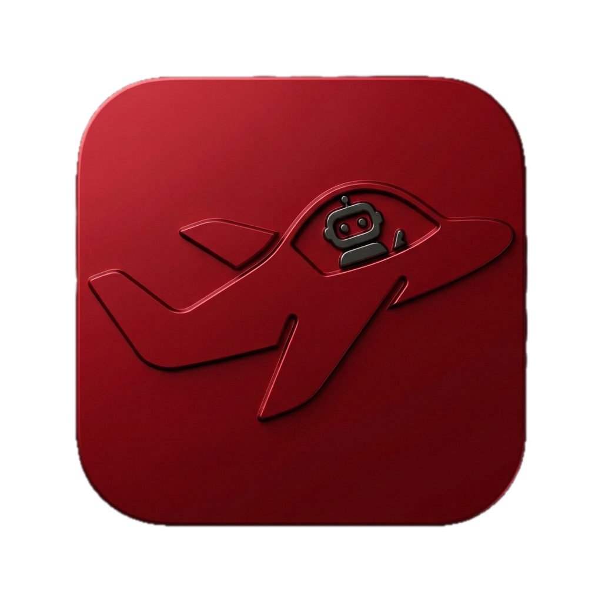

<p align="center">
  
</p>

<h1 align="center">Open Cockpit</h1>

<p align="center">
  Orchestrate multiple Claude Code sessions through a shared pool.
  <br /><br />
  <a href="https://github.com/EliasSchlie/open-cockpit/releases/latest"><strong>⬇️ Download for macOS</strong></a>
  &nbsp;&nbsp;·&nbsp;&nbsp;
  <a href="https://github.com/EliasSchlie/open-cockpit/releases">All releases</a>
</p>

---

## The problem

Claude Code runs in terminals. When you launch a new `claude` process in the same directory as one that's already running, the existing session's Bash tool silently loses its output. This makes it impractical to spawn Claude sessions on the fly - whether you're a human opening a second terminal or an agent delegating work to another Claude.

## How Open Cockpit solves it

Instead of spawning and killing Claude processes, Open Cockpit maintains a **pool of pre-started Claude instances** running in background terminals. Sessions are never opened or closed - they're reused via `/clear` (reset conversation) and `/resume <uuid>` (load a previous conversation). This avoids the Bash output collision entirely.

The pool is shared: humans and Claude agents interact with it the same way. A human presses Cmd+N to grab a fresh session. An agent calls the API to do the same thing. Both draw from the same pool, and when all slots are busy, the least-recently-used idle session gets offloaded to free up a slot.

## For humans

The app provides a sidebar showing all your Claude sessions - which ones are processing, which are waiting for input, and which are idle. Clicking a session opens its Claude TUI directly in the app's terminal, so you can see what Claude is doing and respond.

- **Cmd+N** - grab a fresh session from the pool (offloads the oldest idle one if needed). Optional setup scripts auto-type commands into new sessions.
- **Session sidebar** - see status at a glance across all sessions, with origin tags (pool, sub-claude, ext)
- **Intention editor** - each session has a markdown file describing its goal, editable in-app
- **Offloaded sessions** - old sessions are saved and automatically resumed when you click on them (the app runs `/resume <uuid>` in a pool slot behind the scenes)
- **Pool inspector** - click any pool slot in settings to see its live terminal output

External Claude sessions (started outside the app) also appear in the sidebar for visibility.

## For agents

The app exposes a [Unix socket API](docs/api.md) and CLI (`bin/cockpit-cli`) that give agents the same pool access as humans. The CLI supports sub-claude-compatible commands:

```bash
id=$(cockpit-cli start "refactor auth module")   # fire-and-forget
cockpit-cli wait "$id"                            # wait for result
cockpit-cli followup "$id" "now add tests"        # multi-turn
cockpit-cli capture "$id"                         # live terminal output
```

This enables recursive orchestration - a Claude session can dispatch work to other Claude sessions through the pool, and those can do the same.

## Architecture

The app has three layers:

1. **PTY daemon** (`src/pty-daemon.js`) - a standalone Node.js process that owns all terminal PTYs. Terminals survive app restarts. Multiple clients can attach to the same terminal. ([docs](docs/pty-daemon.md))

2. **Electron main process** (`src/main.js`) - manages the pool, discovers sessions, handles offloading/resuming, and runs the API server.

3. **Renderer** (`src/renderer.js`) - the UI with session sidebar, intention editor (CodeMirror 6), and embedded terminal (xterm.js).

A **Claude Code plugin** (`hooks/`) runs inside each Claude session to report status back to the app - mapping PIDs to session UUIDs, detecting idle/processing state, and syncing intention file changes. ([docs](docs/hooks.md))

## Install

### Download

Download the latest `.dmg` from [GitHub Releases](https://github.com/EliasSchlie/open-cockpit/releases):
- **Apple Silicon** (M1/M2/M3/M4): `Open Cockpit-x.x.x-arm64.dmg`
- **Intel**: `Open Cockpit-x.x.x.dmg`

### First launch (unsigned app)

The app is ad-hoc signed but not notarized. macOS will show "damaged" or "can't be verified" on first open. To fix:

1. Open the DMG and drag **Open Cockpit** to `/Applications`
2. Run in Terminal:
   ```bash
   xattr -cr /Applications/Open\ Cockpit.app
   ```
3. Open the app normally

The `xattr -cr` must be run on the `.app` in `/Applications`, not just the DMG - macOS re-adds quarantine when you copy.

### Plugin

Install the Claude Code plugin for session tracking:

```bash
claude plugin install open-cockpit@elias-tools
```

The app checks for both Claude Code and the plugin on first launch and will guide you through setup.

> **Troubleshooting: "Permission denied (publickey)" during install**
>
> If `claude plugin install` fails with an SSH error, your git is configured to use SSH for GitHub but you don't have SSH keys set up. Fix by telling git to use HTTPS instead:
> ```bash
> git config --global url."https://github.com/".insteadOf git@github.com:
> ```
> To revert this later (e.g., after setting up SSH keys):
> ```bash
> git config --global --unset url."https://github.com/".insteadOf
> ```

### Build from source

```bash
git clone https://github.com/EliasSchlie/open-cockpit.git
cd open-cockpit
npm install
npm start
```

## Further documentation

- [CLAUDE.md](CLAUDE.md) - developer guide (architecture, dev workflow, key paths)
- [docs/pty-daemon.md](docs/pty-daemon.md) - PTY daemon protocol and debugging
- [docs/api.md](docs/api.md) - programmatic API reference
- [docs/hooks.md](docs/hooks.md) - plugin hook details
- [docs/theme.md](docs/theme.md) - color scheme and customization
