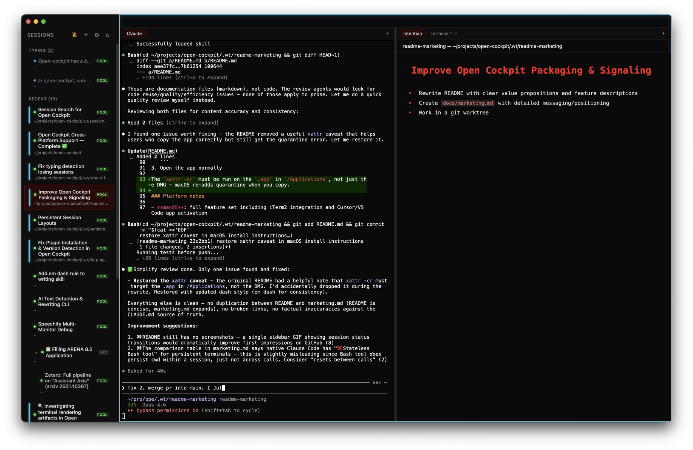

<p align="center">
  
</p>

<h1 align="center">Open Cockpit</h1>

<p align="center">
  A mission control for all your Claude Code sessions.
  <br /><br />
  <a href="https://github.com/EliasSchlie/open-cockpit/releases/latest"><strong>⬇️ Download</strong></a>
  &nbsp;&nbsp;·&nbsp;&nbsp;
  <a href="https://github.com/EliasSchlie/open-cockpit/releases">All releases</a>
  <br />
  Available for macOS · Linux · Windows
</p>

---

<p align="center">
  
</p>

## What it does

Open Cockpit is a desktop app and Claude Code plugin that solves five problems with running Claude Code at scale:

### 1. 🔭 Session overview across your entire machine

Every Claude Code session on your device shows up in a single sidebar — color-coded by status (processing, idle, waiting for review). Jump to the session that just finished with a keyboard shortcut instead of hunting through terminal tabs.

### 2. 🤖 Agent-to-agent orchestration that actually works

Claude Code blocks recursive spawning by default. Working around it breaks Bash tool output. Open Cockpit fixes both: it maintains a **pool of pre-started Claude instances** and provides a CLI + API so any session can dispatch work to others seamlessly.

```bash
id=$(cockpit-cli start "refactor auth module")   # fire-and-forget
cockpit-cli wait "$id"                            # block until done
cockpit-cli followup "$id" "now add tests"        # multi-turn
```

### 3. 🖥️ Persistent terminals

Claude Code's native Bash tool resets between calls — no SSH sessions, no virtual environments, no long-running processes. Open Cockpit gives each session persistent terminal tabs backed by a PTY daemon that survives app restarts.

### 4. 👀 Shared terminal collaboration

Open Cockpit terminals are visible to both you and Claude. You run a command, Claude sees the output. Claude runs a command, you see what happened. This creates a true shared workspace — not just one-shot command execution.

```bash
cockpit-cli term exec 'npm test'          # run in ephemeral shell, get output
cockpit-cli term run 1 'make build'       # run in existing tab, get output
cockpit-cli term watch 1                  # follow output in real-time
```

### 5. 📝 Intention tracking

Every session writes an intention file — a markdown doc describing what the agent is working on. You can read and edit these in-app. Agents see your edits and adapt their work accordingly, giving you a lightweight steering mechanism beyond just prompting.

## How it works

Open Cockpit maintains a **pool of pre-started Claude instances** running in background terminals. Sessions are reused via `/clear` and `/resume` — never spawned or killed on the fly. This avoids the Bash output collision that makes native multi-session use unreliable.

The pool is shared: humans and agents interact with it identically. A human presses **Cmd+N** to grab a session. An agent calls the API to do the same. When all slots are busy, the least-recently-used idle session is offloaded automatically.

### Architecture

1. **PTY daemon** — standalone process owning all terminal PTYs. Terminals survive app restarts. Multiple clients can attach to the same terminal. ([docs](docs/pty-daemon.md))

2. **Electron app** — manages the pool, discovers sessions, handles offload/resume, runs the API server, and renders the UI (session sidebar, intention editor, embedded terminals).

3. **Claude Code plugin** — hooks running inside each Claude session that report status back to the app (PID→UUID mapping, idle detection, intention sync). ([docs](docs/hooks.md))

## Install

### Download

Download the latest installer from [GitHub Releases](https://github.com/EliasSchlie/open-cockpit/releases):

| Platform | File |
|----------|------|
| **macOS (Apple Silicon)** | `Open Cockpit-x.x.x-arm64.dmg` |
| **macOS (Intel)** | `Open Cockpit-x.x.x.dmg` |
| **Linux** | `Open Cockpit-x.x.x.AppImage` or `.deb` |
| **Windows** | `Open Cockpit Setup x.x.x.exe` |

### Platform notes

- **macOS**: full feature set including iTerm2 integration and Cursor/VS Code app activation
- **Linux**: full core features; iTerm and app activation features are macOS-only
- **Windows**: full core features; CLI (`cockpit-cli`) requires bash (WSL or Git Bash)

### Plugin

Install the Claude Code plugin for session tracking:

```bash
claude plugin install open-cockpit@elias-tools
```

The app checks for both Claude Code and the plugin on first launch and will guide you through setup.

> **Troubleshooting: "Permission denied (publickey)" during install**
>
> If `claude plugin install` fails with an SSH error, your git is configured to use SSH for GitHub but you don't have SSH keys set up. Fix by telling git to use HTTPS instead:
> ```bash
> git config --global url."https://github.com/".insteadOf git@github.com:
> ```
> To revert this later (e.g., after setting up SSH keys):
> ```bash
> git config --global --unset url."https://github.com/".insteadOf
> ```

### Build from source

```bash
git clone https://github.com/EliasSchlie/open-cockpit.git
cd open-cockpit
npm install
npm start
```

## Further documentation

- [CLAUDE.md](CLAUDE.md) — developer guide (architecture, dev workflow, key paths)
- [docs/api.md](docs/api.md) — programmatic API reference and CLI commands
- [docs/pty-daemon.md](docs/pty-daemon.md) — PTY daemon protocol and debugging
- [docs/hooks.md](docs/hooks.md) — plugin hook details
- [docs/theme.md](docs/theme.md) — color scheme and customization
- [docs/shortcuts.md](docs/shortcuts.md) — keyboard shortcuts reference
- [docs/marketing.md](docs/marketing.md) — detailed feature breakdown and positioning
